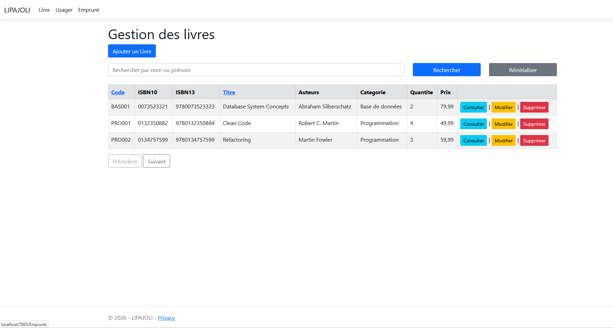
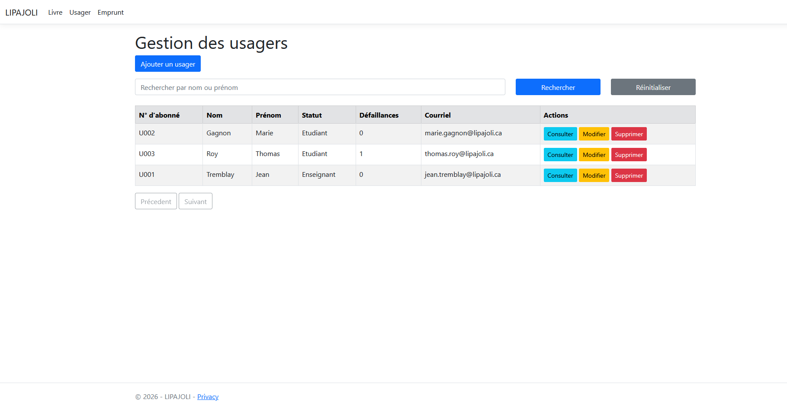
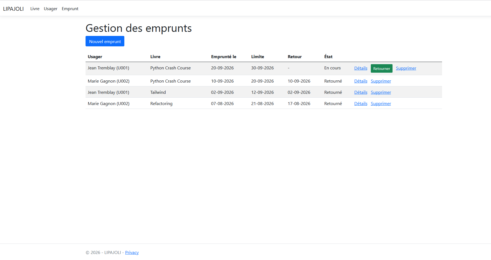
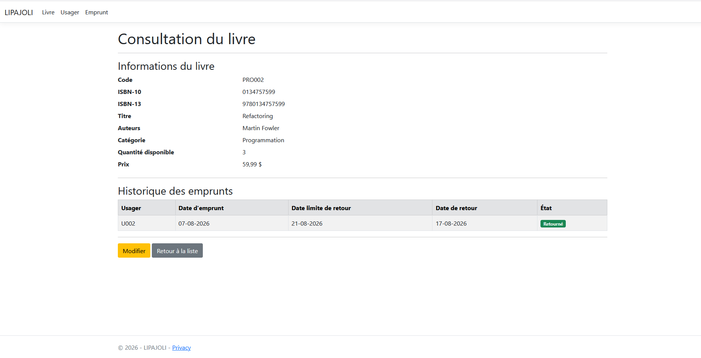

# 📚 LIPAJOLI

> Application web de gestion de bibliothèque permettant de gérer les livres, les usagers et les emprunts.

## 🎯 Présentation

LIPAJOLI est une application web de gestion de bibliothèque développée dans le cadre de ma formation en développement d'applications.

L'application permet de centraliser la gestion des livres, des usagers et des emprunts au sein d'une même solution.

Le projet met en pratique plusieurs concepts liés au développement d'applications, notamment la conception d'une API, la gestion des données, l'architecture logicielle et le développement d'une interface utilisateur.

## ✨ Fonctionnalités

### 📚 Gestion des livres

- Consulter la liste des livres
- Rechercher un livre
- Ajouter un livre
- Modifier un livre
- Supprimer un livre
- Consulter les informations d'un livre

### 👤 Gestion des usagers

- Consulter la liste des usagers
- Rechercher un usager
- Ajouter un usager
- Modifier un usager
- Supprimer un usager
- Consulter les informations d'un usager

### 📖 Gestion des emprunts

- Effectuer un emprunt
- Retourner un livre
- Consulter les emprunts en cours
- Consulter l'historique des emprunts
- Consulter la fiche d'un emprunt
- Identifier l'usager et le livre associés à un emprunt

## 🛠️ Technologies utilisées

- C#
- ASP.NET Core
- Angular
- Entity Framework Core
- SQL Server
- Git
- GitHub

## 🏗️ Architecture

Le projet est organisé de manière à séparer les différentes responsabilités de l'application.

Cette organisation permet notamment de séparer la présentation, la logique applicative et l'accès aux données.

## 🔐 Sécurité

La sécurité constitue un aspect important du développement d'applications.

Les pratiques de sécurité réellement mises en œuvre dans le projet seront détaillées dans cette section.

> Cette section sera complétée en fonction des mécanismes de sécurité effectivement présents dans l'application.

## 🖥️ Aperçu

🏠 Page d'accueil / interface principale


📚 Gestion des livres


👤 Gestion des usagers


📖 Gestion des emprunts



🔄 Retour d'un livre / historique



## ⚙️ Installation

### Prérequis

Avant de lancer le projet, assurez-vous d'avoir installé les outils nécessaires au fonctionnement de l'application.

### Installation

```bash
git clone https://github.com/YvanNgatchouYonpang/LIPAJOLI.git

📚 Compétences mises en pratique

Ce projet m'a permis de mettre en pratique :

Développement en C#
Développement d'API avec ASP.NET Core
Développement frontend avec Angular
Manipulation d'une base de données SQL Server
Utilisation d'Entity Framework Core
Conception d'une application structurée
Gestion d'un projet avec Git et GitHub
Mise en pratique de principes de développement sécurisé
🚀 Améliorations possibles

Parmi les évolutions possibles du projet :

Amélioration de l'authentification et de l'autorisation
Renforcement de la sécurité des API
Ajout de tests supplémentaires
Amélioration de l'expérience utilisateur
Amélioration de la documentation technique
👨‍💻 Auteur

Yvan Ngantchou Yonpang
Mamadou Mouctar Diallo
